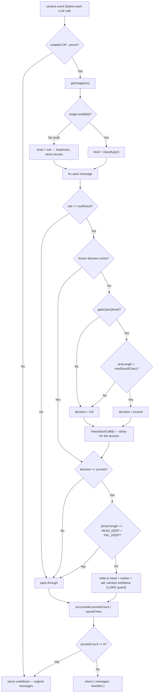
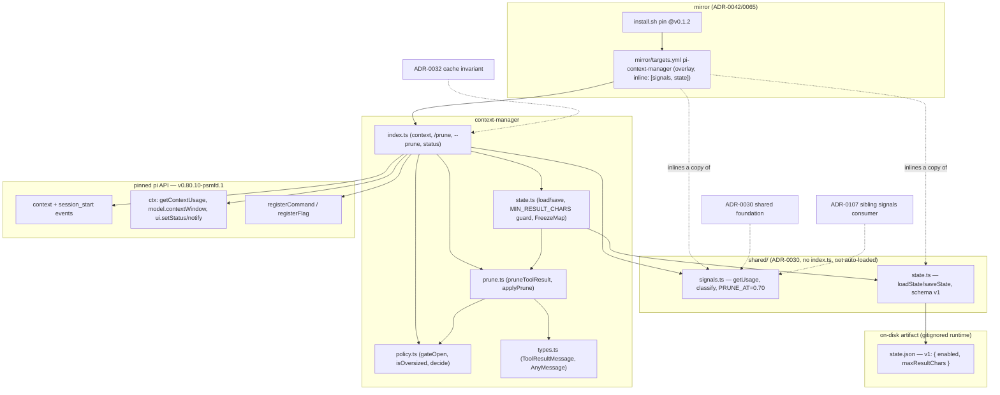

# context-manager

Cache-safe, **zero-token** context pruning for pi. When enabled, oversized tool
output is elided to a head + tail excerpt — but only for results first seen while
the context is under pressure, and that decision is **frozen** so the sent prefix
never changes turn-over-turn and provider prompt caching stays hot. Part of the
Pi Extension Suite (#327); consumes the [`shared/`](https://github.com/psmfd/pi-config/blob/main/agent/extensions/shared/README.md)
foundation. See [ADR-0032](https://github.com/psmfd/pi-config/blob/main/adrs/0032-context-manager.md).

## Install

```sh
pi install git:github.com/psmfd/pi-context-manager
```

Try it first without installing: `pi -e git:github.com/psmfd/pi-context-manager`.

## Why custom (not an adopted extension)

Both maintained candidates were rejected at inspection because their core
mechanism **rewrites the cached prefix**, violating the suite's binding cache
invariant: `@davecodes/pi-dcp` dedups/purges aged content across the full message
array; `pi-context-prune` summarizes earlier tool-call trees (and spends LLM
tokens doing it). Neither can be configured append-side-only. Evidence and the
build decision are in [ADR-0032](https://github.com/psmfd/pi-config/blob/main/adrs/0032-context-manager.md) / #334.

## How it stays cache-safe

Providers price cached input ~10× below fresh, matching on the **exact message
prefix**; editing any already-sent message invalidates the cache from that point
forward. The `context` event hands a fresh deep copy of the *original* messages
every turn, so the cache-busting mistake is re-deciding each message against
*current* usage (its sent form then flips full→pruned mid-session).

This extension instead **freezes each tool result's treatment the first turn it
is seen** (`toolCallId → full | pruned`, in memory):

1. A result first seen with **headroom** (usage `< PRUNE_AT` = 0.70) → frozen `full`, stays full forever.
2. A result first seen **under pressure** *and* **oversized** (combined text > the cap) → frozen `pruned`, stays pruned.

Because each message's sent form is a pure function of its own content and its
frozen decision — independent of position, age, and later usage — the prefix is
byte-identical turn-over-turn. Old prefix bloat is left to pi's built-in
compaction (a rare, bounded cache event); this extension only caps **new** output
as it arrives.

Only `toolResult` **content** is rewritten — the message and its `toolCallId`
always remain, so tool-call/result pairing is never broken.

The elision marker names the tool it replaced (`elided N chars from <toolName>`).
Because a tool name is attacker-influenceable (a dynamically-registered or
malicious tool could embed newlines or brackets), `toolName` is **sanitized**
before it is interpolated into that model-visible marker — control and bracket
characters are stripped and the length is bounded — so a crafted name cannot
break out of the annotation and plant text the model reads as an instruction
(LLM01, indirect prompt injection; `prune.ts`).



## Hooks & coexistence

`context` only (plus `session_start` for state restore). It shares no hook with
any other Pi Extension Suite member — the others fire on `before_agent_start`
(auto-router), `agent_end` (indexing), `session_before_compact`/`session_compact`
(compaction-optimizer), or `before_provider_request` (payload-tuner, ADR-0106) —
so there is no cross-extension collision. No LLM calls → zero extra tokens. The
`context` handler wraps its work in try/catch and returns the original messages
unchanged on any error, so a future SDK message-shape change degrades to a no-op
(logged) rather than breaking the turn.

```mermaid
sequenceDiagram
    participant Pi as Pi runtime
    participant CM as context-manager (index.ts)
    participant Sig as shared/signals.ts
    participant St as shared/state.ts (fs)
    participant UI as status bar / notify
    participant User as User

    Pi->>CM: session_start
    CM->>St: loadState("context-manager", DEFAULT_STATE)
    St-->>CM: { enabled, maxResultChars }
    CM->>CM: frozen.clear()
    CM->>UI: setStatus(prune on/off)

    User->>CM: /prune on | off | status
    alt on/off
        CM->>St: saveState(cfg)
    end
    CM->>Sig: getUsage(ctx)
    CM->>UI: notify(ON/OFF; cap=N chars/result; usage=X%)

    Pi->>CM: context(event.messages) — before every LLM call
    alt disabled and --prune not set
        CM-->>Pi: undefined (messages unchanged)
    else enabled
        CM->>Sig: getUsage(ctx)
        Sig-->>CM: level (ok/prune/escalate/force) or null
        CM->>CM: applyPrune(messages, level, cap, frozen)
        alt prunedCount == 0
            CM-->>Pi: undefined (no-op path)
        else prunedCount > 0
            CM-->>Pi: { messages: rewritten }
        end
        Note over CM: try/catch — any error logs and returns undefined; a turn is never broken
    end
```

## Controls

| Control | Effect |
|---|---|
| `/prune on` / `/prune off` | Toggle automatic elision; persisted (`shared/state.ts`, namespace `context-manager`). |
| `/prune status` (or `/prune`) | Show ON/OFF, the per-result cap, and live context usage. |
| `--prune` | Enable for the current session (in addition to the persisted toggle). |

Status bar: `✂️ prune on` / `✂️ prune off`.

## State

`~/.pi/agent/extensions/context-manager/state.json`, schema-versioned (`{v:1}`):
`{ enabled, maxResultChars }`. `maxResultChars` (default `12000`) is the per-result
cap measured in **characters** (JS string `.length`, UTF-16 code units — not
bytes); a result over it, seen under pressure, is elided to the first `HEAD_KEEP`
(2000) + last `TAIL_KEEP` (2000) chars. (The field was named `maxResultBytes`
before #804 corrected it; `load()` still adopts a legacy `maxResultBytes` value so
a tuned state file is not reset on upgrade.) A hand-edited cap below
`HEAD_KEEP + TAIL_KEEP` — which could never elide — is repaired to the default on
load. The freeze map is in-memory only — a `/reload` re-derives decisions against
current usage (one bounded cache event; pairing always preserved).

## Files

| File | Role |
|---|---|
| `index.ts` | Factory: wires `context`, `/prune`, `--prune`, the `✂️` status segment, and `session_start` state restore + freeze-map reset. |
| `policy.ts` | The prune decision: oversized × under-pressure gate (`shared/signals.ts` level), pure so it is safe to freeze. |
| `prune.ts` | Elision mechanics (`pruneToolResult`, deterministic head/tail excerpt) + the `applyPrune` freeze-and-rewrite loop. |
| `state.ts` | Persisted toggle/cap + in-memory `FreezeMap`. |
| `types.ts` | Structural `ToolResultMessage` / `AnyMessage` shapes the pruner reads. |

Module structure, the shared-library and pinned-API dependencies, the on-disk
artifact, and the mirror distribution path:



## Deferred (post-v1)

- **`session_before_compact` lever** — domain-aware compaction; only if the built-in summary proves too lossy.
- **Cache-busting "deep reclaim" `/prune` mode** — dedup/age-based reclamation; rejected for v1 because it reintroduces the rejected candidates' invariant violation.

## API provenance

Verified against **pi v0.80.10-psmfd.1** — the `agent/vendor/pi` pin (#804;
originally validated against pi v0.79.0 in Phase 0 #328). The API shapes are
unchanged at the current pin: the `context` event (`docs/extensions.md`) fires
before each LLM call, hands a deep copy of `event.messages`, and returns
`{ messages }`; the `ToolResultMessage` shape; `ctx.getContextUsage()` /
`ctx.model.contextWindow` (via `shared/signals.ts`);
`registerCommand`/`registerFlag`/`setStatus`. (Doc line numbers are intentionally
not cited — they drift as `docs/extensions.md` is edited.)

## Tests

```sh
./scripts/test-context-manager.sh          # node:test via tsx
VERBOSE=1 ./scripts/test-context-manager.sh
```

Unit tests cover the elision mechanics, the freeze/gate decision, the sticky
apply loop (including the cache-safety property — re-running over the originals
yields a stable result), and state load/save (including the `maxResultBytes`
legacy-rename back-compat). The structural typing runs the core offline without a
live pi runtime. Live suite-wide cache-hit-ratio measurement was completed in
**#338** (closed): the full suite achieved a **CHR of 0.73–0.87** on
github-copilot, confirming the cached-prefix invariant holds in practice — no
pathological prefix churn. The measurement harness (`cache-meter` +
`scripts/analyze-cache-ratio.sh`) shipped in #348 / ADR-0034 and is reusable for
future per-provider runs.
